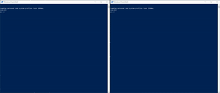

# PSRAPID


> A PowerShell API Framework

[releasebadge]: https://img.shields.io/static/v1.svg?label=version&message=1.0.2&color=blue
[datebadge]: https://img.shields.io/static/v1.svg?label=Date&message=2019-04-05&color=yellow
[psbadge]: https://img.shields.io/static/v1.svg?label=PowerShell&message=5.0.0&color=5391FE&logo=powershell
[btbadge]: https://img.shields.io/static/v1.svg?label=bartender&message=6.1.22&color=0B2047


| Language | Release Version | Release Date | Bartender Version |
|:-------------------:|:-------------------:|:-------------------:|:-------------------:|
|![psbadge]|![releasebadge]|![datebadge]|![btbadge]|


Authors: Adrian Andersson

Company: Domain Group

Latest Release Notes: [here](./documentation/1.0.2/release.md)

***

<!--Bartender Dynamic Header -- Code Below Here -->


***
##  Getting Started

### Installation
How to install:
```powershell
install-module -name psrapid

```

### Demonstration Gif


### Configuration

#### Setup your API Folder
```powershell
#Import the module
import-module psRapid


#Create a directory for our API
$apiPath = 'c:\psRapid'
if(!(test-path $apiPath))
{
    new-item $apiPath -itemType Directory
}

```

#### Create an 'API' endpoint function
```powershell

#Subdirectory in your api path
$apiFolder = "$apiPath\api"
if(!(test-path $apiFolder))
{
    new-item $apiFolder -itemType Directory
}


#Advanced PS Function in your subdirectory
#Add in a special pageControl attribute to control access and caching
$mathTest = @'
<#
    .SYNOPSIS
        Add two numbers together
        
    .DESCRIPTION
        Add two numbers together
        
    .PARAMETER x
        The first number to add

    .PARAMETER y
        The second number to add
    
#>

[PageControl(
    cache = $true,
    networkRange = ('127.0.0.1/32','10.0.0.0/8'),
    tokenRequired = $false,
    cacheMins = 3
)]

[CmdletBinding()]
param(
    [int]$x,
    [int]$y
)

if(($x -is [int])-and(($y -is [int])))
{
    [pscustomobject] @{
        x = $x
        y = $y
        result = $x+$y
        method = 'add'
    }
}
'@

$mathTest | out-file "$apiFolder\math.ps1"


```


#### Start listening for requests

```powershell


#Set your params
$port = 9889 #Port to listen on
$apiHostName = 'localhost' #Use asterisk to listen for all hostnames, use localhost to lock it down to local requests only
$requireToken = $false #Should we blanket require API Tokens regardless of the pageControl attribs?
$defaultCacheTime = 15 #How many minutes should we keep results in the cache by default (Override with pageControl)
$defaultCacheBehaviour = $true #Should we cache responses for faster api times (Override with pageControl)
$defaultAuthBehaviour = $false #By default, should pages require an auth token (Override with pageControl)

#Turn on Verbosity so you can see whats going on
$VerbosePreference = 'continue'

#Start the listener class (Your PS Window will lock)
[listener]::NEW($port,$apiHostname,$apiPath,$requireToken,$defaultCacheTime,$defaultCacheBehaviour,$defaultAuthBehaviour)

```

#### Make a rest call against your new listener 
`(In a new window)`

```powershell
invoke-restmethod -uri 'http://localhost:9889/math?x=1&y=2'

```

#### Grab your admin token and stop your listener
```powershell
#Reference your api path
$apiPath = 'c:\psRapid'
#Reference to the tokens xml file
$tokenPath = "$apiPath\config\tokens.xml"
#Grab the admin token
$adminToken = $($(import-clixml "$apiPath\config\tokens.xml")|Where-Object{$_.username -eq 'Administrator'}).token
#Construct a header
$tokenHeader = @{'x-api-token' = $adminToken}
#Invoke an admin page request to stop the listener
Invoke-restmethod 'http://localhost:9889/admin/stop' -Headers $tokenHeader
```

***
## What Is psrAPId

psrAPId is a fast-to-build API framework that takes standard PowerShell functions (as files) and turns them into rest endpoints.

The original version was created over a weekend in March 2018. I wanted an API back-end that I could use to learn REACT+AXIOS. It didn't need to be fast. It did need to be easy to use, expand, change, and try stuff out. Since PowerShell is my primary coding language, I wanted it in PowerShell.

I looked at a few existing PowerShell based API options, and I was left a little frustrated. My thought process was `I should be able to just write a fairly standard PowerShell function then have my API framework evaluate the function and make it Restable with the least amount of setup and configuration, and the most amount of discovery and documentation`

I decided to do it with PowerShell Classes to really expand my knowledge of how they work in, plus I thought the inheritance could come in handy.

I was pleasantly surprised with how it the original version performed. It can handle between 3-10 rest calls per second, depending on the performance of your scripts, the amount it's cached, and the server you are running it on. Obviously this pales in comparison to a proper API, but depending on your needs it may be more than suitable.

### What do we use it for

- As a rest-proxy service so we can control auth
- As a way to rapidly prototype and PoC rest methods
- To handle things like SNS Topic subscriptions
- To handle webhook events and start automation tasks


### Features

- Token Support
  - Uses Headers object - 'x-api-token'
  - Can be toggled off for standard access
  - Saves the tokens within a `.\config\tokens.xml` file (import with `import-clixml`)
- Built-In Admin Requests
  - Used to create/restrict new tokens
  - Locked-down access based on token
- Standard JSON output objects
- Runs PowerShell scripts as http page requests
  - Output will be consolidated into an 'items' array
- Self Documenting
  - Script Parameters can be passed back to the API as 'inputs'
  - Folder Structure and PS1 Files will be returned as links
- Response Caching
  - Will cache pages and responses in the interest of performance
  - Caching can be controlled on both a default level and with a special `pageControl` attribute
- Per-method access config (Via `pagecontorl` attribute)
  - Can limit page authorisation to CIDR's if required
  - Can limit page auth based on token acceptance
- No CORS
  - I turned it off
- Allows use of POST or GET
  - They are treated the same on the API level, all params will be bundled up and splatted to your function
  - Choose one type only
    - If you send a post method, it will use the post params
    - If you send any other type of method, it will use the querystring params
- Basic Script Error Handling
  - If your function fails, the basic page response will be provided rather than nothing at all
- Writen in PowerShell
  - Uses PowerShell classes
  - The Admin Page is built-in with its own class
- Works on Linux
  - Managed to get it working on PsCore running on a UBUNTU server
- Logs to a file
  - logs will be saved to `.\config\log.txt`

### What's Missing
- No HTTPS
  - Where we (At Domain) are using this internally, we do our cert-termination on the load-balancer
  - Otherwise its used for PoC and local traffic only, so we never had a need to implement
  - If you really want support for HTTPS please let me know (Or even put in a pull-request)
- No User Groups
  - I've started working on this but it isn't done yet.
- Doesn't take cache control headers (To-Do)
- Lots of the verbose logging will be commented out
  - I've done this to try and keep logging as low as possible and performance up
- There isn't alot of documentation
  - Haven't found a good way to document classes, if you know of one, please let me know
- Probably need to rework the error response
- Code Coverage seems a little sparse
  - it's actually not, it just doesn't seem to handle classes very well


### Tips for Using psrAPId
- Use NSSM to run it as a service
  - It can be unstable when receiveing requests in quick succession
  - AKA psrAPId crashes after 200 requests in a row
- Use hashtables and clixml import/export to simulate databases
  - I found the import and export adds not a lot of time to the request
  - Hashtables are very fast and this has been an ideal way of PoC database type data
- Keep your functions clean and fast
  - If your having performance issues, check it's not your script thats causing the slowness
  - psrAPId works best with short, fast functions
- Use Comment-Based Help
  - By putting in proper comment-based help, psrAPId will send the params etc back in the inputs section
- Use the pageControl to change the cache behaviour
  - Probably not a good idea to cache things like dice rolls etc
- Check the Pester Tests in the source code for a good example on additional functions and setup
- Some ports are restricted and you need admin to use them
   -  Standard web ports like 80 fall into this category
- Similarly, you may need to run as admin to listen on more than just `localhost`
  - You can set the listener to '*' to listen on all hosts
- You can use the admin pages to
  - Add new users
  - Disable users
  - Clear the caches
  - Add and revoke Admin
  - List users
- You can make a single function available to localhost only by setting the network range to '127.0.0.1/32'
- Check the returned LINKS and INPUTS items for function documentation and API navigation


***
## Acknowledgements
Domain Group for `InnovationDay` projects, without which I wouldn't have needed to make this

Jay Wang for his thorough testing and ideas (Network restricting)

Richard Zhang for testing this out and motivation to get it working


<!--Bartender Link, please leave this here if you make use of this module -->
***

## Build With Bartender
> [A PowerShell Module Framework](https://github.com/DomainGroupOSS/bartender)

